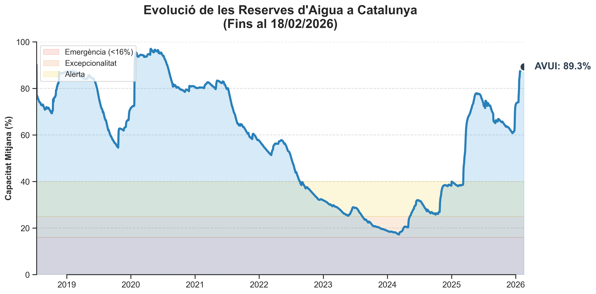

# Reportatge de Dades: Estat de l'Aigua (18/02/2026)

**Les Reserves d'Aigua a Catalunya Assoleixen el seu Millor Nivell dels Darrers Cinc Anys**

A data de 18 de febrer de 2026, les reserves d'aigua a Catalunya registren un notable 89.3% de la seva capacitat total, marcant una recuperació hídrica significativa. Aquesta xifra contrasta dràsticament amb la situació de fa just un any, el 2025, quan els embassaments es trobaven en un preocupant 38.4%. L'estat actual també supera el 80.3% que presentaven les reserves catalanes fa cinc anys, el 2021, consolidant un escenari hídric molt favorable i el millor dels darrers lustres.

Malgrat l'excel·lent estat general del sistema, no tots els pantans gaudeixen de la mateixa bonança. L'Embassament de Siurana, situat a Cornudella de Montsant, es troba actualment en la situació més delicada, amb una capacitat del 49.30%, molt per sota de la mitjana catalana i evidenciant la persistència de desequilibris territorials en la gestió dels recursos hídrics.